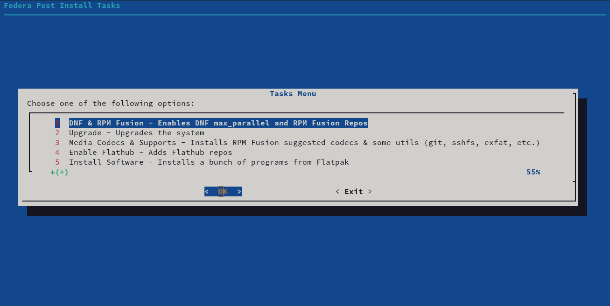

# Fedora post install tasks
Some tasks I usually do after installing Fedora. If you want you can use it, at your own risk!

## Usage
Git clone the repo or directly download the sh script and run it.
```
wget https://raw.githubusercontent.com/rfloc95/Fedora_post_install/main/fedora_post_install.sh
sh fedora_post_install.sh
```
The package **dialog** and sudo priviledges are required. 
The main menu with the task options will be displayed, simply launch the one you want to set. The order is not mandatory, however some tasks require the previous ones (3 requires 1, 5 requires 4). In general I suggest to follow the given order. 



## Current options
1) DNF & RPM Fusion;
2) Upgrade;
3) Media Codecs & Supports;
4) Enable Flathub;
5) Custom Prompt;
6) Install Software (Flatpaks);
7) R & RStudio;
8) Fedora ToolBox;
9) Miniconda;
10) Exit & Reboot.

#### DNF & RPM Fusion
Sets DNF max_parallel_downloads flag to 20 (deafult=3) and adds RPM Fusion proprietary repos.

#### Upgrade
Upgrades the system.

#### Media Codecs & Supports
From RPM Fusion installs suggested proprietary codecs (gstreamer, openh264, ffmpeg, etc.) and some utils packages such as sshfs, git, openssl-devel, libcurl-devel, exfat-utils.

#### Enable Flathub
Adds Flathub remote to flatpak. The Fedora one does not contain proprietary apps (like Slack).

#### Custom Prompt
Modifies terminal prompt, nothing serious, just aesthetics.

#### Install Software
You can select which flatpak app install from a list. Current list:
- Firmware;
- FontDownloader;
- Fragments;
- GIMP;
- Inkscape;
- VSCode;
- MarkText;
- Flatseal;
- OnlyOffice;
- Slack;
- Telegram;
- Zoom;
- Spotify;
- PDFArranger.

#### R & RStudio
Installs R, RStudio dekstop and FlexiBLAS API interface for R (with all optimized blas backends).

#### Fedora ToolBox
Adds the Fedora toolbox containers based on podman. Very useful to test or use different versions of programs (like R).

#### Miniconda
Adds Miniconda and sets up the superior conda package manager **mamba**.

#### Reboot
Reboot option. Suggested as final operation.


